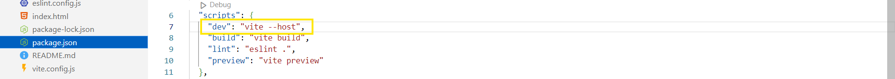
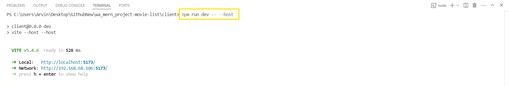

# Exposing Localhost for Mobile Testing: A Step-by-Step Guide

### Using a Framework (e.g., Vite with React)

There are two ways to test your application when using a framework:

1. **Modify the Dev Script:**  
    <br />
   Add the `--host` flag to the dev script (located at `package.json` file under scripts). For example, if you're using Vite with React, run the following command in your terminal:

   ```bash
   npm run dev -- --host
   ```

2. **Directly Run the Dev Script:**  
    <br />
   Alternatively, you can add the `--host` flag directly to your dev script and run it.

### Without a Framework (Manual Setup)

If you're not using a framework, follow these steps:

1. **Open Command Prompt:**  
   Open the command prompt and type the following command:

   ```bash
   ipconfig
   ```

2. **Locate the IPv4 Address:**  
   Find your local IPv4 address under the network adapter section. For example:

   ```
   IPv4 Address: 192.168.68.106
   ```

3. **Construct the External URL:**  
   Copy the IPv4 address and append the port and path from your localhost URL. For example, if your localhost website's URL is `http://localhost:5173/new`, then combine the IPv4 address with the port and path like this:
   ```
   http://192.168.68.106:5173/new
   ```

Now, your website will be accessible externally using the constructed URL.

### Troubleshooting

- **If you see a "Cannot be reached" or "Connection timeout" message when accessing it on mobile:**
  - Check your firewall settings, specifically for **Public Networks**.
  - If the firewall is on, try turning it off temporarily to see if the connection works.
